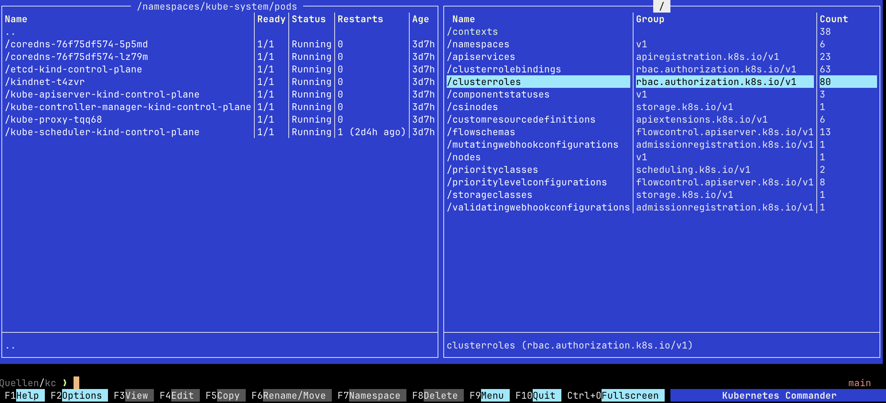

# Experimental: Kubernetes Commander (kc)



A TUI (Terminal User Interface) for Kubernetes inspired by Midnight Commander, built with Go and BubbleTea.

> **Disclaimer:** this repo is heavily vibe coded.

## Features

### ✅ Completed
- **Two‑Panel TUI**: BubbleTea/Lipgloss interface with function‑key bar and integrated 2‑line terminal
- **Kubeconfig Management**: Discover kubeconfigs and contexts; quick context switching
- **Cluster Client + Cache**: Controller‑runtime clients with shared cache; dedicated Table cache for server‑side Tables
- **Hierarchical Navigation**: Contexts → namespaces → resource groups → object lists → object details (containers, keys)
- **Server‑Side Tables**: Object lists render API Table columns, support Normal/Wide columns, Age column, and object ordering
- **F2 Options**: Context‑aware dialog for Objects vs Resources; per‑panel and persisted settings
- **F3 View**: View object YAML; view ConfigMap/Secret key values with secret auto‑decoding when textual
- **Config System**: `~/.kc/config.yaml` with sensible defaults; theme, table mode, object columns/order, mouse, TTL, etc.
- **Tests**: Unit tests + envtests (where supported) for nav, UI rendering, viewers, and object ordering/age

### 🚧 In Progress
- Resource informers for live updates across all folders
- F4 Edit, F7 Create, F8 Delete workflows
- F9 context menus
- Terminal integration with kubectl commands

## Architecture

### Core Components

1. **Handler System** (`pkg/handlers/`)
   - `BaseHandler`: Generic operations for all resources
   - `PodHandler`: Pod-specific functionality (logs, exec, status)
   - `Registry`: Maps GVKs to handlers
   - Extensible for any Kubernetes resource type

2. **Kubeconfig Management** (`pkg/kubeconfig/`)
   - Discovers all kubeconfigs in `~/.kube`
   - Manages contexts and clusters
   - Creates controller-runtime clients
   - Supports multiple kubeconfig files

3. **TUI Framework** (`internal/ui/`)
   - `App`: Main application with two-panel layout
   - `Panel`: File/resource browser with navigation
   - `Terminal`: Integrated terminal with kubectl support
   - Function key bindings (F1-F10)

### Key Design Principles

- **Use Existing Kubernetes Concepts**: No unnecessary wrapping of `client.Object`, `schema.GroupVersionKind`, etc.
- **Generic Base Operations**: All resources get standard operations automatically
- **Resource-Specific Extensions**: Only add functionality that's unique to specific resource types
- **Modular and Extensible**: Easy to add new resource types and handlers

## Usage

### Building
```bash
go build -o kc ./cmd/kc
```

### Running
```bash
./kc
# or without building first
go run ./cmd/kc
```

### Debug Logging
- By default, controller-runtime and Kubernetes logs are discarded.
- Set `DEBUG=1` to enable debug logs written to `~/.kc/debug.log` using a human-friendly zap encoder:

```bash
DEBUG=1 ./kc
# or
DEBUG=1 go run ./cmd/kc
```

Notes:
- Both controller-runtime and klog (k8s.io/klog/v2) are wired to the same logger.
- When `DEBUG` is not set, both are redirected to a discard logger.


### Configuration
- Path: `~/.kc/config.yaml`
- Keys are lower‑case; loader tolerates legacy/mixed‑case and normalizes.

All settings (with defaults):

```yaml
viewer:
  # Chroma theme used by the YAML/text viewer (lower-case).
  # You can change it at runtime from within the viewer (F9), which will persist this value.
  theme: dracula

panel:
  table:
    # Table mode for object lists: scroll or fit
    mode: scroll
  scrolling:
    horizontal:
      # Number of characters moved per left/right pan in horizontal-scrolling modes.
      # Used by internal table components; keep >= 1. Default: 4.
      step: 4

input:
  mouse:
    # Double-click timeout; two clicks within this duration on the same row
    # trigger Enter (same as pressing Enter). Default: 300ms.
    doubleClickTimeout: 300ms

kubernetes:
  clusters:
    # TTL for controller-runtime clusters in the shared pool; idle clusters are
    # evicted after this time. Duration format (e.g., 2m, 30s). Default: 2m.
    ttl: 2m

resources:
  # Show only resource groups with non-zero counts (true) or all (false).
  showNonEmptyOnly: true
  # How often hidden resources are re-checked via API peeks (duration, default 30s).
  peekInterval: 30s
  # Ordering of resource groups: alpha | group | favorites
  order: alpha
  # Favorites for order=favorites. Plural names, lower-case.
  favorites: [pods, services, deployments, replicasets, statefulsets, daemonsets, jobs, cronjobs, configmaps, secrets, ingresses, networkpolicies, persistentvolumeclaims]
 
objects:
  # Object list ordering:
  # - name | -name | creation | -creation
  order: name
  # Columns mode for server-side Tables:
  # - normal: show priority 0 columns (kubectl default)
  # - wide: show all server-provided columns (like `kubectl get -o wide`)
  columns: normal
```

Themes (lower-case)
- turbo-pascal
- dracula
- monokai
- github-dark
- nord
- solarized-dark
- solarized-light
- gruvbox-dark
- friendly
- borland
- native

Change theme at runtime: open a viewer (F3), then press F2 to open the theme dialog (or use Esc+2). Moving the cursor previews live; Enter applies and saves; Esc Esc or F10 cancels and restores the previous theme.


### Key Bindings
- `F1`: Help
- `F2`: Options
  - In lists: opens context‑aware dialog (Objects View Options or Resources View Options)
  - In viewer: opens the Theme selector
- `F3`: View
  - On objects: YAML viewer
  - On ConfigMap/Secret keys: value viewer (secrets auto‑decode when textual)
- `F4`: Edit resource
- `F5`: Copy
- `F6`: Rename/Move
- `F7`: Create namespace
- `F8`: Delete resource
- `F9`: Context menu
- `F10`: Quit
- `Ctrl+O`: Toggle terminal
- `Ctrl+W`: Toggle Normal/Wide columns (priority 0 vs all server-side table columns)
- `Tab`: Switch panels
- `Ctrl+C`: Quit

## Examples

### Handler Usage
```bash
go run examples/handler/main.go
```

### Kubeconfig Discovery
```bash
go run examples/kubeconfig/main.go
```

## Testing

Run all tests:
```bash
go test ./... -v
```

With coverage summary:
```bash
go test ./... -cover
```

Run specific component tests:
```bash
go test ./pkg/handlers/... -v
go test ./pkg/kubeconfig/... -v
go test ./internal/ui/... -v
```

Notes:
- Some tests use Kubernetes envtest to spin up a local control plane for integration coverage (navigation, viewers, ordering/Age). These require a non‑sandboxed environment with permission to bind local ports. In restricted sandboxes, run the unit‑only subset as shown above.

### Pre‑commit Hook
Add a Git pre‑commit hook to run `go build ./...` and tests before each commit.

Setup once per clone:
```bash
git config core.hooksPath .githooks
```

By default, the hook runs the full test suite (`go test -v ./...`). For a faster loop that skips envtests, set:
```bash
PRECOMMIT_FAST=1 git commit -m "your message"
```

## Project Structure

```
kc/
├── cmd/kc/                 # Main application entry point
├── internal/ui/            # TUI components (App, Panel, Terminal)
├── pkg/handlers/           # Resource handlers and registry
├── pkg/kubeconfig/         # Kubeconfig management
├── examples/               # Usage examples
│   ├── handler/           # Handler system examples
│   └── kubeconfig/        # Kubeconfig examples
├── internal/navigation/   # Navigator + folders (contexts, namespaces, objects, containers, keys)
├── internal/table/        # Grid/table rendering (BigTable, rows, lists)
└── README.md              # This file
```

## Next Steps

1. **Resource Informers**: Implement live updates using Kubernetes informers
2. **Navigation Hierarchy**: Build the context → namespace → resource navigation
3. **Resource Selection**: Create F2 resource selector with presets
4. **View/Edit Commands**: Implement F3/F4 functionality
5. **Create/Delete Operations**: Add F7/F8 operations
6. **Context Menus**: Build F9 popup menus
7. **Terminal Integration**: Complete kubectl integration
8. **Configuration System**: Add `~/.kc/config.yaml` configuration
9. **Custom Resources**: Support for CRDs
10. **Documentation**: Complete user documentation

## Contributing

This project follows Go best practices:
- Non-trivial logic MUST be covered by unit tests
- Write tests first (TDD approach)
- Use existing Kubernetes concepts directly
- Keep components modular and extensible
- Comprehensive testing for all functionality

See AGENTS.md for detailed contributor guidelines.

## License

[License information to be added]
