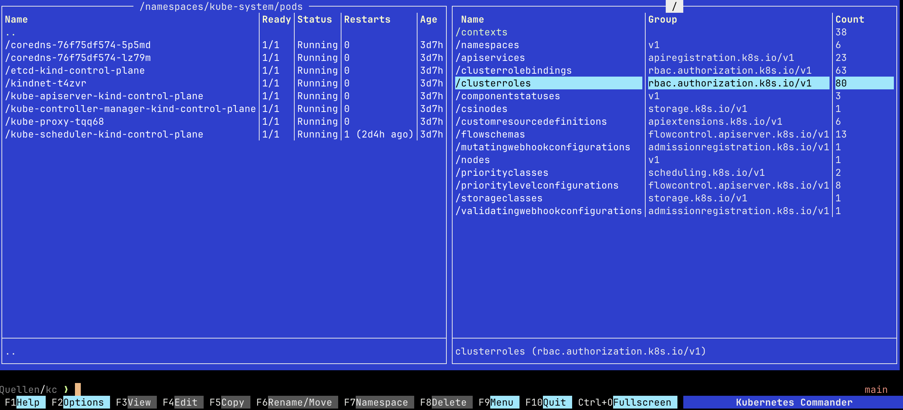

# Kubernetes Commander (kc)

[](https://github.com/sttts/kc/actions/workflows/build.yml)



An experiment in building a two-panel Kubernetes TUI entirely with AI. Inspired by Midnight Commander, powered by Go 1.24, Bubble Tea v2, and controller-runtime informers.

> ⚠️ **Vibe-coded warning:** this project is 100 % AI-authored. No human has reviewed the code, so expect sharp edges, missing affordances, and sudden regressions. See `TODO.md` for the evolving plan.

## Highlights

- **Kubectl-compatible startup intents:** `kc get ...` and `kc logs ...` parse familiar CLI syntax and launch directly into the matching folders, multi-selecting objects and opening manifest/log viewers when requested (`docs/designs/cli-intents.md`).
- **Hierarchy-first navigation:** contexts → namespaces → resource groups → object folders → virtual subfolders (pod containers, ConfigMap/Secret keys, etc.). Every row is keyed by full `group/version/resource`.
- **Child object hierarchies:** drill from parents into their children (e.g., Deployments → ReplicaSets → Pods, Services → EndpointSlices) via per-object child folders so related resources stay discoverable in the tree.
- **Live data via informers:** controller-runtime caches back all folders; add/update/delete events keep selections and scroll offsets stable.
- **Two synchronized panels:** each panel can render lists or manifest viewers, supports multi-selection, per-panel options (columns/order/modes), and an integrated function-key bar. A 2-line terminal lives underneath for quick kubectl work.
- **Rich viewers:** YAML/text viewer with syntax highlighting, wrap toggle, search (`F7`), and next-match (`F3`). Logs viewer streams `kubectl logs` with follow mode, search, and End-to-follow shortcuts.
- **Container internals:** each pod container exposes `/logs` plus a `/root` browser so you can inspect container filesystems from kc. When images lack shell tooling, kc can spin up a debug helper automatically.
- **Local exports:** any resource that supports `F3` viewing (YAML, logs, ConfigMap/Secret data, pod filesystem files, etc.) can be saved locally via `F5` with an inline directory+path picker.
- **Config + persistence:** `~/.kc/config.yaml` controls viewer theme, panel widths, table modes, discovery TTL, mouse preferences, and more. Runtime changes (theme, table mode, etc.) persist back to disk.

## Getting Started

### Build and Run

```bash
go run ./cmd/kc
```

Prefer a compiled binary?

```bash
go build -o kc ./cmd/kc
./kc
```

### Install via Homebrew

```bash
brew tap sttts/homebrew-kc
# macOS (notarized GUI build)
brew install --cask sttts/homebrew-kc/kc

# Linux / CLI-only formula
brew install sttts/homebrew-kc/kc
```

## Releases

Binaries are published by the maintainers via GitHub Releases and the Homebrew tap. Push a `v*` tag to trigger the Goreleaser workflow, which builds/signed binaries, publishes the GitHub Release, notarizes the macOS artifacts, and refreshes the Homebrew tap. See `docs/RELEASING.md` for the Apple signing credentials required for CI.

### Kubectl-style shortcuts

Kubernetes Commander accepts a subset of kubectl syntax so you can jump straight to the desired view:

- `kc get pods` – focuses the Pods list for the current/flagged namespace.
- `kc get deploy myapp -o yaml` – highlights `myapp`, opens the manifest viewer in the opposite panel.
- `kc get pods/nginx pods/api svc/frontend` – multi-selects rows across resources.
- `kc logs payments-0 -c worker --follow` – drills down to the pod → container → logs row and opens the streaming viewer.

All commands honor `-n/--namespace`; when omitted, kc uses the kubeconfig’s default.

## Key Bindings

| Key        | Action                                                                          |
|------------|---------------------------------------------------------------------------------|
| `F1`       | Help – opens the README.md markdown viewer (windowed modal).                    |
| `F2`       | Options – context-aware panel options or viewer theme dialog.                   |
| `F3`       | View – YAML viewer, ConfigMap/Secret key viewer, pod logs viewer, etc.          |
| `F4`       | Edit – launches `kubectl edit` for the selected Kubernetes object.              |
| `F5`       | Copy – download the current YAML/log/log/file to the local filesystem.          |
| `F7`       | Create namespace (panels) / Search (viewers/logs).                              |
| `F8`       | Delete – opens the confirmation modal and issues a DELETE via controller client.|
| `F9`       | Menu – Open custom commands menu.                                               |
| `F10`      | Quit (`Esc+0` alternative; `Ctrl+Q` also exits).                                |
| `Tab`      | Switch panels.                                                                  |
| `Ctrl+O`   | Toggle the integrated terminal.                                                 |
| `Ctrl+C`   | Quit.                                                                           |

Function keys are also reachable via `Esc+<digit>` (e.g., `Esc+3` for `F3`). Unimplemented slots (`F6`) are hidden/disabled until their workflows land.

## Custom Commands

You can define custom shell commands in `~/.kc/config.yaml` and execute them via the **F9** menu. Commands run in a terminal panel and can use templates to reference the selected item.
By default, kc ships with `Top Nodes` (global) and `Top Pods` (namespace-scoped) until you define your own commands.

### Configuration Example

```yaml
commands:
  - name: "Top Pods"
    command: "kubectl top pods -n {{.Namespace}}"
    type: "namespace" # Sticky for the current namespace
    watchInterval: 5s
    showFor:
      resources: ["pods"]

  - name: "Top Nodes"
    command: "kubectl top nodes"
    type: "global" # Independent of selection
    watchInterval: 5s

  - name: "Shell ($SHELL)"
    command: "$SHELL"
    type: "global"
    interactive: true
    onExit: "restore" # Return to previous panel mode when the shell exits

  - name: "Describe Resource"
    command: "kubectl describe {{.Resource}} {{.Name}} -n {{.Namespace}}"
    type: "selector" # Reruns when selection changes
    location: "panel"
    onExit: "keep-open"
```

### Command Types
- **selector**: Triggered by selection, reruns on change. Good for `describe`, `get -o yaml`, etc.
- **sticky**: Starts with current selection but keeps running.
- **namespace**: Sticky for the current namespace, restarts on namespace change.
- **global**: Independent of selection. Good for cluster-wide commands like `top nodes`.

### Templating
Available variables: `{{.Name}}`, `{{.Namespace}}`, `{{.Kind}}`, `{{.Group}}`, `{{.Version}}`, `{{.Resource}}`.

## Configuration

`~/.kc/config.yaml` stores all user preferences. Key sections:

- `viewer.theme`, `viewer.mode` – chroma theme and wrap mode for YAML/text/log viewers.
- `panel.table.mode`, `panel.scrolling.horizontal.step` – object-table rendering and panning behavior.
- `resources.showNonEmptyOnly`, `resources.order`, `resources.favorites` – resource-group listing controls (leave `favorites` empty to follow discovery's `all` category).
- `objects.order`, `objects.columns` – server-side Table ordering and wide/normal column display.
- `kubernetes.discovery.refresh`, `kubernetes.clusters.ttl` – discovery invalidation and cluster pool TTLs.
- `input.mouse.doubleClickTimeout` – double-click threshold for Enter events.

Run `kc` once to materialize defaults or inspect `config-default.yaml`.

### Full configuration (defaults + inline docs)

Copy/paste into `~/.kc/config.yaml` to start customizing:

```yaml
viewer:
  theme: dracula
  mode: scroll

panel:
  scrolling:
    horizontal:
      step: 4
  width:
    leftPercent: 50
    rightPercent: 50

input:
  mouse:
    doubleClickTimeout: 300ms

kubernetes:
  clusters:
    ttl: 2m
  discovery:
    refresh: 30s

resources:
  # Default behavior: hide resources with zero objects
  showNonEmptyOnly: true
  # How often to re-peek hidden resources for changes when showNonEmptyOnly is true
  peekInterval: 10s
  # Default ordering: alphabetic by resource plural
  order: alpha
  # Favorites are used when order=favorites; leave empty to use discovery's "all" category.
  favorites: []

objects:
  # Object list ordering: name | -name | creation | -creation
  order: name
  # Columns mode for server-side Tables:
  # - normal: show priority 0 columns (kubectl default)
  # - wide: show all server-provided columns (like `kubectl get -o wide`)
  columns: normal
```

## Contributing / Source

This repo is intentionally vibe-coded. If you want to peek behind the curtain—or help civilize it—see `CONTRIBUTING.md` and `AGENTS.md` for expectations, logging conventions, and build/test commands.
